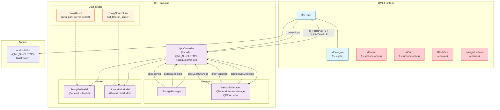

# Архитектура

> Интерактивная диаграмма архитектуры и панель потоков: [`architecture.html`](./architecture.html)
> (SVG, без внешних зависимостей, Solarized-тема). Машиночитаемая модель для ИИ-агентов:
> [`architecture.json`](./architecture.json) — `{nodes, edges, flows:[{steps}]}`.

