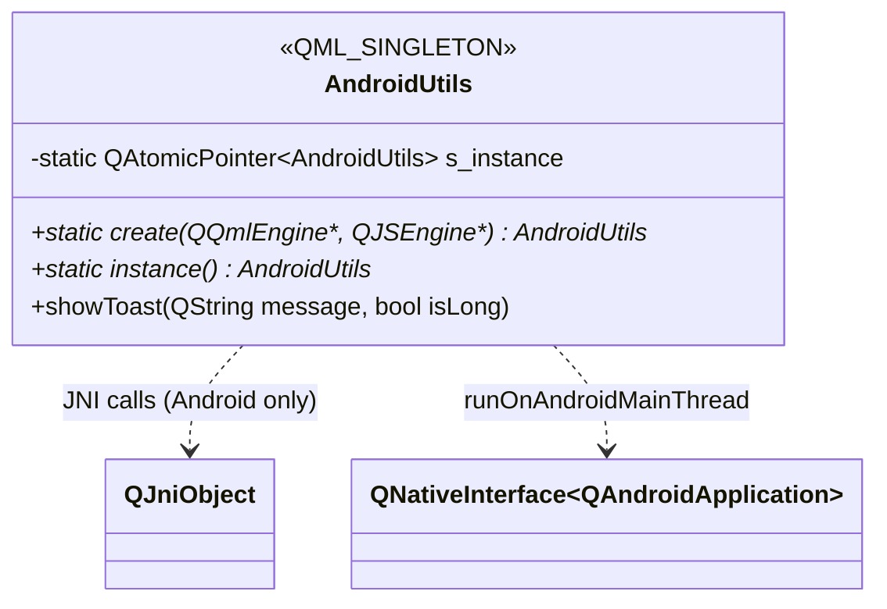
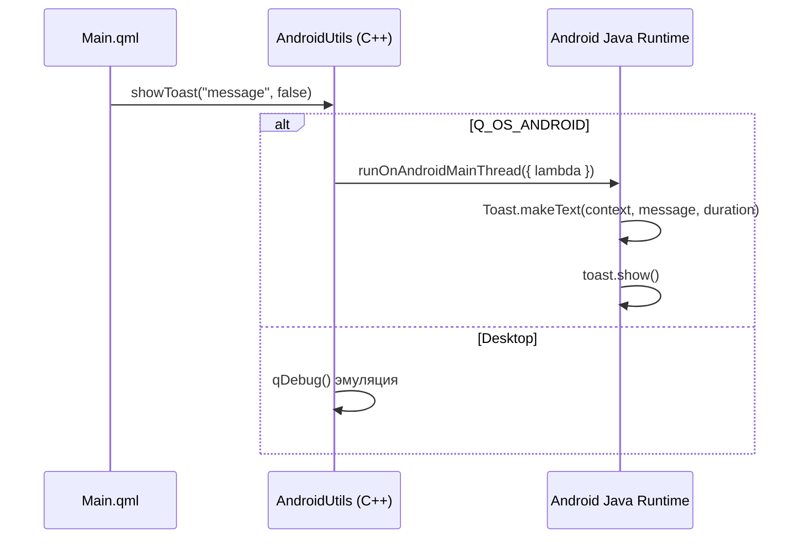

# Архитектура и взаимодействие: Android-интеграция

## 1. Зона ответственности

Модуль `androidutils` предоставляет QML-интерфейс к нативным Android API через JNI. Содержит один синглтон `AndroidUtils` с методом `showToast()`. Работает только на Android; на Desktop эмулируется через `qDebug`.

Модуль НЕ обрабатывает runtime-запросы разрешений Android, хотя в манифесте объявлены `BLUETOOTH_SCAN`, `ACCESS_COARSE_LOCATION` и другие.

## 2. Структура классов и QML-типов



## 3. Сценарий взаимодействия (Рантайм)



## 4. Аудит кода (Ошибки, DRY, Нарушения)

---

### [Критичность] СРЕДНЯЯ: Отсутствует runtime-запрос разрешений Android

- **Локация:** `app/CMakeLists.txt:115-123`, `plugins/androidutils/`
- **Суть ошибки:** `BLUETOOTH_SCAN`, `ACCESS_COARSE_LOCATION` объявлены в манифесте, но в коде нет runtime-запроса через `QAndroidPermissions::requestPermission()`. На Android 12+ (API 31) эти разрешения считаются опасными и требуют явного запроса.
- **Исправление:** Реализовать проверку и запрос разрешения:
```cpp
#if QT_CONFIG(permissions)
auto *perm = new QAndroidPermission("android.permission.BLUETOOTH_SCAN", this);
connect(perm, &QAndroidPermission::ready, this, [this](Qt::PermissionStatus status) {
    if (status == Qt::PermissionStatus::Granted) { /* proceed */ }
});
perm->request();
#endif
```

---

### [Критичность] СРЕДНЯЯ: AndroidUtils.create() — potential double instance / thread-safety

- **Локация:** `plugins/androidutils/androidutils.cpp:8-22`
- **Суть ошибки:** `QAtomicPointer` не имеет блокировки на запись — два потока могут пройти проверку `== nullptr` одновременно. QML Engine может повторно вызвать `create()` и получить существующий объект, что он не ожидает.
- **Исправление:** Использовать `std::once_flag`:
```cpp
static std::once_flag flag;
std::call_once(flag, [&] {
    s_instance.storeRelease(new AndroidUtils());
});
```

---

### [Критичность] СРЕДНЯЯ: Отсутствует `#include <QTime>`

- **Локация:** `plugins/androidutils/androidutils.cpp:4-6`
- **Суть ошибки:** Используется `QTime::currentTime()` в конструкторе, но нет `#include <QTime>`.
- **Исправление:** Добавить `#include <QTime>`.

---

### [Критичность] НИЗКАЯ: Избыточные комментарии в androidutils.h

- **Локация:** `plugins/androidutils/androidutils.h:7-11`
- **Суть ошибки:** Комментарий "TODO Module should only load in mobile mode" и "Question: how to check in qml that module is not loaded?" — это нерешённая архитектурная заметка, не комментарий для разработчика. Нет инструкции, как проверить, загружен ли модуль в QML.
- **Исправление:** Краткое описание: `// Singleton for Android JNI bridge. Only available on Q_OS_ANDROID. Check with Qt.platform.os in QML.`
