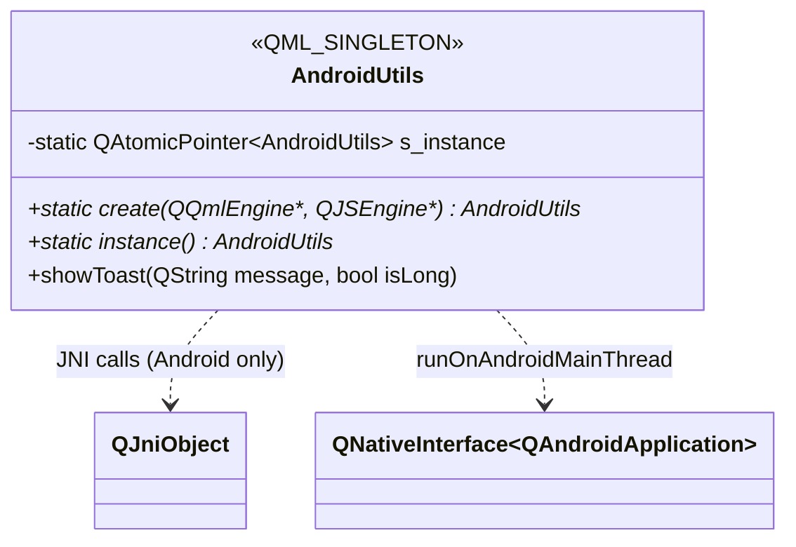
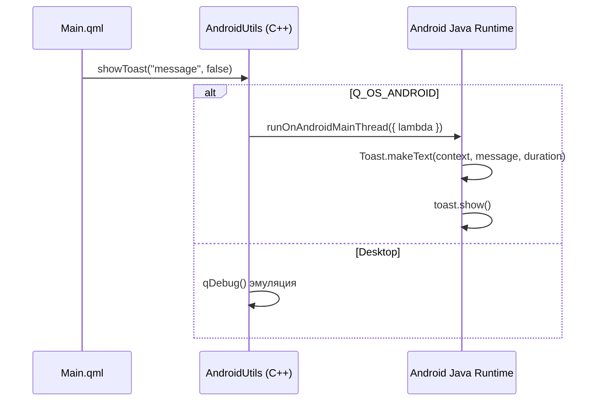

# Архитектура и взаимодействие: Android-интеграция

## 1. Зона ответственности

Модуль `androidutils` предоставляет QML-интерфейс к нативным Android API через JNI. Содержит один синглтон `AndroidUtils` с методом `showToast()`. Работает только на Android; на Desktop эмулируется через `qDebug`.

## 2. Структура классов и QML-типов



## 3. Сценарий взаимодействия (Рантайм)



## 4. Аудит кода (Ошибки, DRY, Нарушения)

---

### [Критичность] СРЕДНЯЯ: Отсутствует runtime-запрос разрешений Android

- **Локация:** `app/CMakeLists.txt:86-93`, `plugins/androidutils/`
- **Суть ошибки:** Разрешение `BLUETOOTH_SCAN` объявлено в манифесте (через CMake) с `minSdkVersion 31` и `neverForLocation`, но в C++/QML коде отсутствует runtime-запрос этого разрешения через `QAndroidPermissions::requestPermission()` (Qt 6.5+) или JNI прямой вызов. На Android 12+ (API 31) `BLUETOOTH_SCAN` — опасное разрешение, требующее runtime-запроса.
- **Исправление:** Реализовать проверку и запрос разрешения в `AndroidUtils`:

```cpp
#if QT_CONFIG(permissions)
auto *perm = new QAndroidPermission("android.permission.BLUETOOTH_SCAN", this);
qRegisterMetaType<Qt::PermissionStatus>();
connect(perm, &QAndroidPermission::ready, this, [this](Qt::PermissionStatus status) {
    if (status == Qt::PermissionStatus::Granted) {
        // proceed
    }
});
perm->request();
#endif
```

---

### [Критичность] СРЕДНЯЯ: AndroidUtils.create() — potential double instance

- **Локация:** `plugins/androidutils/androidutils.cpp:8-22`
- **Суть ошибки:** Если QML Engine запросит синглтон повторно, метод `create()` возвращает существующий экземпляр. Это корректно, но QML Engine не ожидает возврата существующего объекта через фабричный метод — он может повторно установить parent или вызвать деструктор старого. В комбинации с `QAtomicPointer` нет блокировки на запись — два потока могут пройти проверку `== nullptr` одновременно.
- **Исправление:** Использовать std::once_flag или QMutex для потокобезопасности:

```cpp
static std::once_flag flag;
std::call_once(flag, [&] {
    s_instance.storeRelease(new AndroidUtils());
});
```

---

### [Критичность] НИЗКАЯ: Избыточные комментарии в androidutils.h

- **Локация:** `plugins/androidutils/androidutils.h:31-43`
- **Суть ошибки:** Блок комментария "Приватный конструктор часто используется вместе с паттернами..." — это скопированная теоретическая справка из обучающего материала. Загромождает код, не добавляя информации, специфичной для проекта.
- **Исправление:** Оставить краткое описание: `// Singleton — приватный конструктор, доступ через create()/instance()`.
