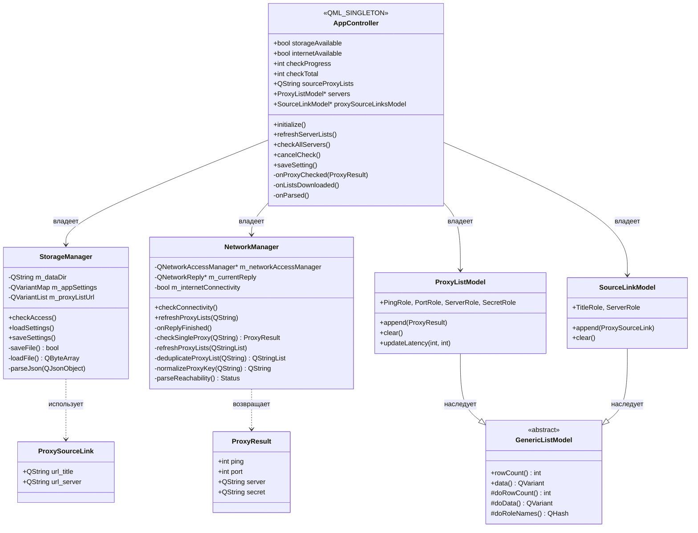
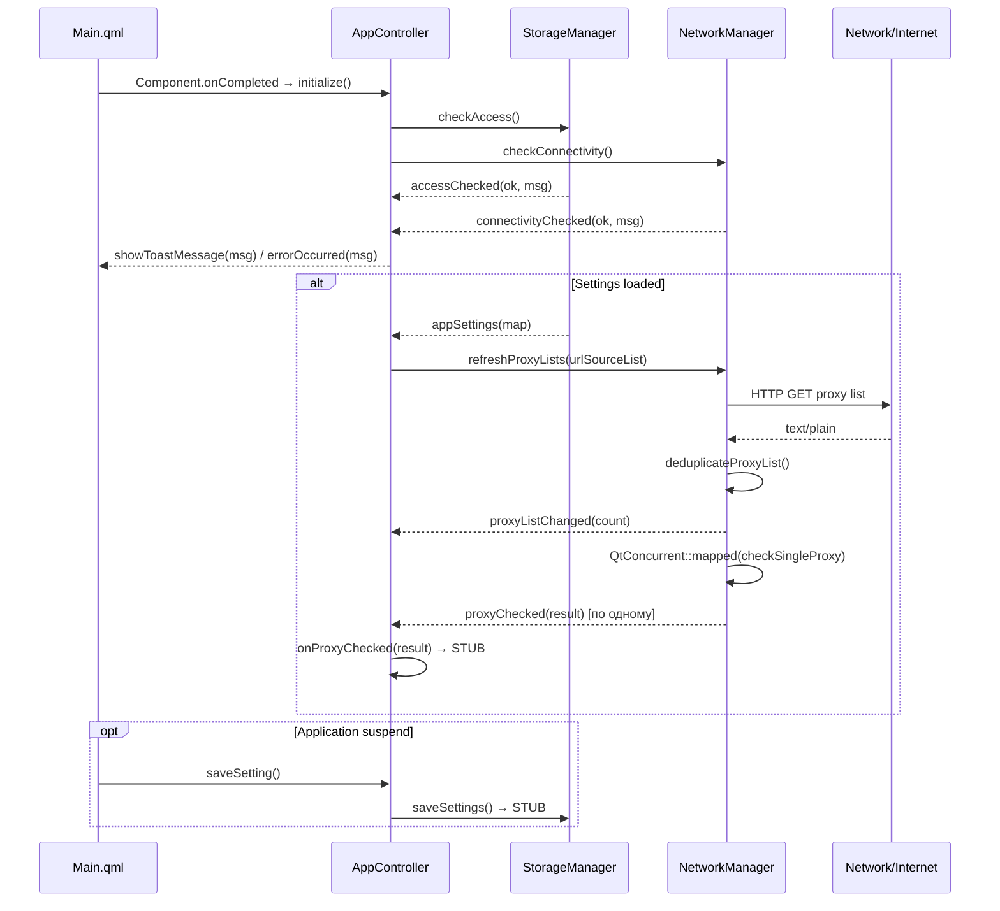

# Архитектура и взаимодействие: Core Plugin (C++)

## 1. Зона ответственности

Core Plugin — центральный C++ модуль, управляющий бизнес-логикой: проверка хранилища, мониторинг сетевой связности, загрузка и парсинг списков прокси, асинхронная проверка серверов через `QtConcurrent`. Предоставляет QML-фронтенду два синглтона (`AppController`, `AndroidUtils`) и два невидимых внутренних класса (`StorageManager`, `NetworkManager`).

Связь C++ ↔ QML:
- `AppController` (QML_SINGLETON) — фасад: инициализация, загрузка списков, запуск проверки, состояние storage/network
- QML подписывается через `Connections { target: AppController }` на сигналы C++
- Данные прокси-серверов — через `ProxyListModel` (QAbstractListModel), привязанный к `ListView`

## 2. Структура классов и QML-типов



## 3. Сценарий взаимодействия (Рантайм)



## 4. Аудит кода (Ошибки, DRY, Нарушения)

---

### [Критичность] ВЫСОКАЯ: Cross-thread сигнал с незарегистрированным типом

- **Локация:** `plugins/core/networkmanager.cpp:162-177`
- **Суть ошибки:** `ProxyResult` имеет `Q_DECLARE_METATYPE`, но нет вызова `qRegisterMetaType<ProxyResult>()` перед использованием в сигналах через `QtConcurrent::mapped`. Qt выдаст warning и может потерять аргументы сигнала при跨-поточной передаче.
- **Исправление:** Добавить в `main.cpp` или конструктор `NetworkManager`:
```cpp
qRegisterMetaType<ProxyResult>("ProxyResult");
```

---

### [Критичность] ВЫСОКАЯ: Незакрытый QFutureWatcher при повторном вызове

- **Локация:** `plugins/core/networkmanager.cpp:158-177`
- **Суть ошибки:** `refreshProxyLists(const QStringList&)` создаёт новый `QFutureWatcher` при каждом вызове. Если метод вызван дважды, первый watcher продолжает работать, вызывая `proxyChecked` для старого списка. Нет отмены предыдущей очереди.
- **Исправление:** Отменять предыдущий watcher. Хранить указатель на текущий `QFutureWatcher`:
```cpp
// В networkmanager.h: QFutureWatcher<ProxyResult> *m_currentWatcher = nullptr;
if (m_currentWatcher) {
    m_currentWatcher->cancel();
    m_currentWatcher->deleteLater();
}
m_currentWatcher = new QFutureWatcher<ProxyResult>(this);
```

---

### [Критичность] СРЕДНЯЯ: normaliseProxyKey — мёртвая ветка (copy-paste)

- **Локация:** `plugins/core/networkmanager.cpp:223-224`
- **Суть ошибки:** Два одинаковых `else if (urlView.startsWith(u"https://t.me?"))` подряд. Вторая ветка никогда не выполняется. Вероятно, предполагалось `https://t.me/proxy?` для другого формата ссылок.
- **Исправление:** Изменить второе условие или удалить дубликат:
```cpp
} else if (urlView.startsWith(u"https://t.me/proxy?")) {
    paramsPart = urlView.mid(19);
```

---

### [Критичность] СРЕДНЯЯ: Debug-режим принудительно перезаписывает sourceProxyLists

- **Локация:** `plugins/core/appcontroller.cpp:64-65`
- **Суть ошибки:** В `refreshServerLists()` блок `#ifdef QT_DEBUG` жёстко перезаписывает `m_sourceProxyLists`, игнорируя значение, установленное пользователем через QML. При сборке Debug пользователь всегда получает RU-список, независимо от настроек.
- **Исправление:** Использовать debug-значение только как fallback, если список пуст:
```cpp
if (m_sourceProxyLists.isEmpty()) {
#ifdef QT_DEBUG
    m_sourceProxyLists = "https://raw.githubusercontent.com/kort0881/telegram-proxy-collector/refs/heads/main/proxy_ru.txt";
#else
    return;
#endif
}
```

---

### [Критичность] СРЕДНЯЯ: Stub-методы — бизнес-логика не реализована

- **Локация:**
  - `plugins/core/appcontroller.cpp:72` — `checkAllServers()` пуст
  - `plugins/core/appcontroller.cpp:77` — `cancelCheck()` пуст
  - `plugins/core/appcontroller.cpp:132` — `onProxyChecked()` пуст
  - `plugins/core/networkmanager.cpp:153` — `checkSingleProxy()` возвращает пустой `ProxyResult`
  - `plugins/core/storagemanager.cpp:53` — `saveFile()` всегда `false`
  - `plugins/core/storagemanager.cpp:87` — `saveSettings()` пуст
- **Суть ошибки:** Основная функциональность (проверка MTProxy, сохранение настроек) не реализована. Приложение — незавершённый каркас.
- **Исправление:** Реализовать:
  1. `checkSingleProxy()` — TCP-connect к серверу:порту с таймаутом, замер latency
  2. `saveSettings()` — запись JSON в `AppDataLocation/settings.json`
  3. `onProxyChecked()` — добавление результата в `ProxyListModel`

---

### [Критичность] СРЕДНЯЯ: initialize() вызывает refreshServerLists() преждевременно

- **Локация:** `plugins/core/appcontroller.cpp:53-54`
- **Суть ошибки:** `refreshServerLists()` вызывается сразу после `checkAccess()`/`checkConnectivity()`, но до того, как придут асинхронные ответы. Оба флага `m_storageAvailable` и `m_internetAvailable` ещё `false`, поэтому метод сразу выходит. Вызов — мёртвый код.
- **Исправление:** Перенести `refreshServerLists()` в колбэк загрузки настроек:
```cpp
connect(m_storage, &StorageManager::settingsLoaded, this, [this]() {
    refreshServerLists();
});
```

---

### [Критичность] СРЕДНЯЯ: Отсутствует `#include <QTime>`

- **Локация:** `plugins/core/appcontroller.cpp:12`, `plugins/androidutils/androidutils.cpp:59`
- **Суть ошибки:** Используется `QTime::currentTime()` без `#include <QTime>`. На некоторых платформах может не собраться.
- **Исправление:** Добавить `#include <QTime>` в оба файла.

---

### [Критичность] СРЕДНЯЯ: Отсутствует `#include <QDir>` в storagemanager.cpp

- **Локация:** `plugins/core/storagemanager.cpp:33`
- **Суть ошибки:** Используется `QDir dir(m_dataDir)` без `#include <QDir>`. Работает за счёт транзитивных включений, но не гарантировано.
- **Исправление:** Добавить `#include <QDir>`.

---

### [Критичность] НИЗКАЯ: handleCommonResult смешивает toast и error

- **Локация:** `plugins/core/appcontroller.cpp:114-117`
- **Суть ошибки:** `handleCommonResult(true, ...)` шлёт `showToastMessage`, но "AppDataLocation is writable" — не повод для Toast-уведомления пользователю. Это debug-информация.
- **Исправление:** Использовать `qDebug` для информационных сообщений, Toast — только для значимых событий.

---

### [Критичность] НИЗКАЯ: assets/settings.json не используется

- **Локация:** `assets/settings.json`
- **Суть ошибки:** Файл лежит в активах, но `StorageManager` читает только из `AppDataLocation/settings.json`. При первом запуске используются дефолты из кода (`setDefaults()`), а не из этого файла. Файл — мёртвый груз.
- **Исправление:** Либо удалить, либо читать embedded-ресурс как fallback при пустом `AppDataLocation/settings.json`.
