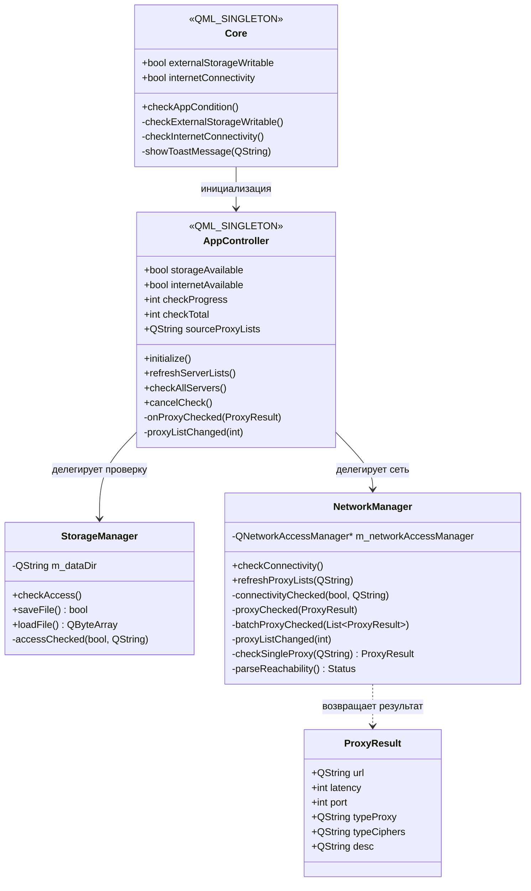
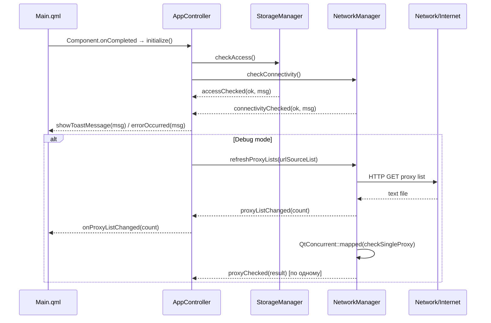

# Архитектура и взаимодействие: Core Plugin (C++)

## 1. Зона ответственности

Core Plugin — центральный C++ модуль, управляющий бизнес-логикой: проверка хранилища, мониторинг сетевой связности, загрузка и парсинг списков прокси, асинхронная проверка серверов через `QtConcurrent`. Предоставляет QML-фронтенду два синглтона (`Core`, `AppController`) и два невидимых внутренних класса (`StorageManager`, `NetworkManager`).

Связь C++ ↔ QML:
- `Core` — глобальный монитор состояния (storage/network), эмитирует `showToastMessage` для UI.
- `AppController` — основной контроллер: инициализация, загрузка списков, запуск проверки.
- QML подписывается через `Connections { target: AppController }` на сигналы C++.

## 2. Структура классов и QML-типов



## 3. Сценарий взаимодействия (Рантайм)



## 4. Аудит кода (Ошибки, DRY, Нарушения)

---

### [Критичность] КРИТИЧЕСКАЯ: Утечка соединений сигнала в Core::checkInternetConnectivity

- **Локация:** `plugins/core/core.cpp:86-111`
- **Суть ошибки:** Каждый вызов `checkInternetConnectivity()` создаёт новое `connect()` к `QNetworkInformation::reachabilityChanged`, не отключая предыдущее. Метод вызывается из конструктора и может быть вызван повторно. Это приводит к:
  1. Множественным срабатываниям лямбды при одном изменении связности
  2. Утечке памяти лямбд-замыканий
  3. Потенциальному `use-after-free` при уничтожении `Core` раньше `QNetworkInformation::instance()`
- **Исправление:** Вынести `connect()` в конструктор, убрать из `checkInternetConnectivity()`. Либо использовать `Qt::SingleShotConnection` (Qt 6.0+) или проверять и дисконнектить перед повторным коннектом.

```cpp
// В конструкторе, один раз:
if (QNetworkInformation::instance()) {
    connect(QNetworkInformation::instance(), &QNetworkInformation::reachabilityChanged,
            this, &Core::onReachabilityChanged);
}
```

---

### [Критичность] ВЫСОКАЯ: Дублирование логики (DRY)

- **Локация:** `plugins/core/core.cpp:66-79` и `plugins/core/networkmanager.cpp:191-208`
- **Суть ошибки:** Switch-блок для маппинга `QNetworkInformation::Reachability → QString` полностью дублируется в двух классах. Нарушение DRY. При добавлении нового типа или смене локализации нужно править в двух местах.
- **Исправление:** Вынести в статическую функцию или утилитарный заголовок:

```cpp
// reachability_utils.h
inline QString reachabilityMessage(QNetworkInformation::Reachability r) {
    switch (r) { /* ... */ }
}
```

---

### [Критичность] ВЫСОКАЯ: Cross-thread сигнал с незарегистрированным типом

- **Локация:** `plugins/core/proxyresult.h:12` и `plugins/core/networkmanager.cpp:173-181`
- **Суть ошибки:** `ProxyResult` имеет `Q_DECLARE_METATYPE`, но нет вызова `qRegisterMetaType<ProxyResult>()` перед использованием в сигналах через `QtConcurrent::mapped`. В debug-режиме Qt выдаст warning и может потерять аргументы сигнала при跨-поточной передаче.
- **Исправление:** Добавить в main.cpp или конструктор NetworkManager:

```cpp
qRegisterMetaType<ProxyResult>("ProxyResult");
```

---

### [Критичность] ВЫСОКАЯ: Незакрытый QFutureWatcher при повторном вызове

- **Локация:** `plugins/core/networkmanager.cpp:173-181`
- **Суть ошибки:** `refreshProxyLists(const QStringList&)` создаёт новый `QFutureWatcher` при каждом вызове. Если метод вызван дважды (например, обновление списка), первый watcher продолжает работать в фоне, вызывая `proxyChecked` для старого списка. Также не вызывается `cancel()` на `QFuture` при старой очереди.
- **Исправление:** Отменять предыдущий watcher перед созданием нового. Хранить указатель на текущий `QFutureWatcher` и вызывать `cancel()` на нём.

```cpp
if (m_currentWatcher) {
    m_currentWatcher->cancel();
    m_currentWatcher->deleteLater();
}
m_currentWatcher = new QFutureWatcher<ProxyResult>(this);
```

---

### [Критичность] СРЕДНЯЯ: Stub-методы без реализации

- **Локация:**
  - `plugins/core/appcontroller.cpp:48` — `checkAllServers()` пустой
  - `plugins/core/appcontroller.cpp:49` — `cancelCheck()` пустой
  - `plugins/core/appcontroller.cpp:88` — `onProxyChecked()` пустой
  - `plugins/core/networkmanager.cpp:168` — `checkSingleProxy()` возвращает пустой `ProxyResult`
  - `plugins/core/storagemanager.cpp:48` — `saveFile()` всегда `false`
  - `plugins/core/storagemanager.cpp:52` — `loadFile()` всегда пустой `QByteArray`
- **Суть ошибки:** Основная функциональность приложения (проверка прокси, сохранение результатов) не реализована. Код находится в состоянии незавершённого каркаса.
- **Исправление:** Реализовать логику проверки MTProxy (подключение по протоколу MTProto через сокет), сохранение результатов в JSON/текстовый файл, загрузку из кэша.

---

### [Критичность] СРЕДНЯЯ: Неиспользуемый enum SenderTypes

- **Локация:** `plugins/core/sendertypes.h`
- **Суть ошибки:** Enum `SenderTypes` объявлен, но нигде не используется. Мёртвый код.
- **Исправление:** Удалить файл или использовать по назначению.

---

### [Критичность] СРЕДНЯЯ: Отсутствует #include <QTime>

- **Локация:** `plugins/core/core.cpp` и `plugins/androidutils/androidutils.cpp`
- **Суть ошибки:** Используется `QTime::currentTime()` без `#include <QTime>`. На некоторых платформах/компиляторах может не собраться.
- **Исправление:** Добавить `#include <QTime>`.
