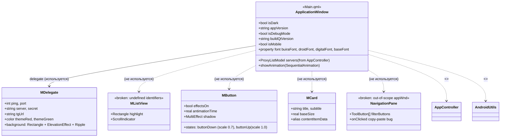
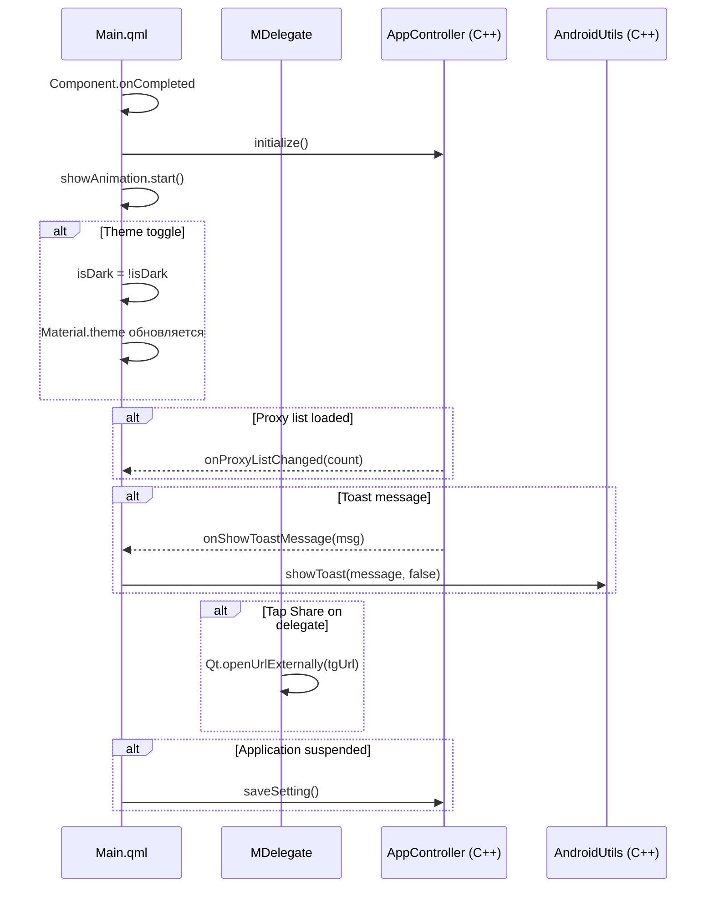

# Архитектура и взаимодействие: QML Frontend

## 1. Зона ответственности

QML-слой отвечает за отрисовку UI, обработку касаний и визуализацию данных от C++ бэкенда. Состоит из главного окна (`Main.qml`) и кастомных компонентов (`MButton`, `MCard`, `MDelegate`, `MListView`, `NavigationPane`). Компоненты `MButton`, `MCard`, `MListView`, `NavigationPane` декларированы, но **не используются** в текущей версии `Main.qml`.

Все C++ синглтоны импортируются и доступны глобально. Связь с C++ — через `Connections { target: AppController }` и прямые вызовы `AppController.initialize()`, `AndroidUtils.showToast()`.

## 2. Структура классов и QML-типов



## 3. Сценарий взаимодействия (Рантайм)



## 4. Аудит кода (Ошибки, DRY, Нарушения)

---

### [Критичность] КРИТИЧЕСКАЯ: Несуществующие идентификаторы в MListView

- **Локация:** `app/qml/MListView.qml:8-12`
- **Суть ошибки:** Используются идентификаторы `darkMode`, `solarizedBase03`, `solarizedBase0`, `solarizedBase2`, `solarizedBase02`, которые не определены ни в самом компоненте, ни в импортированных модулях. QML-движок выдаст runtime-ошибки привязки.
- **Исправление:** Определить свойства в `MListView` или удалить файл (не используется):
```qml
property bool darkMode: false
readonly property color solarizedBase03: "#002b36"
```

---

### [Критичность] ВЫСОКАЯ: Dead code — MainTest.qml (опечатка QT_DEBUG1)

- **Локация:** `app/main.cpp:129`
- **Суть ошибки:** Условие `#ifdef QT_DEBUG1` — опечатка. Макрос никогда не определён. Должно быть `QT_DEBUG`. Если исправить, загрузится несуществующий модуль (MainTest.qml удалён из репозитория).
- **Исправление:** Удалить блок `#ifdef QT_DEBUG1` полностью:
```cpp
engine.loadFromModule("io.github.zanyxdev.mtproxyinspector", "Main");
```

---

### [Критичность] ВЫСОКАЯ: NavigationPane — все onClicked логируют "Россия"

- **Локация:** `app/qml/NavigationPane.qml:43-47, 64-67, 85, 105, 125`
- **Суть ошибки:** Кнопки "Все" (строка 105) и "Настройки" (строка 125) в обработчике `onClicked` пишут `"Фильтр: Россия"` — copy-paste ошибка. Также "Избранное" (строка 44) тоже пишет "Россия".
- **Исправление:** Заменить строки логов на корректные.

---

### [Критичность] ВЫСОКАЯ: NavigationPane ссылается на appWnd вне области видимости

- **Локация:** `app/qml/NavigationPane.qml:16`
- **Суть ошибки:** `Material.background: appWnd.Material.background` — `appWnd` определён в `Main.qml` и недоступен из `NavigationPane`. При инстанцировании будет runtime-ошибка.
- **Исправление:** Передавать цвет фон через свойство:
```qml
property color backgroundColor: Material.color(Material.Background)
Material.background: root.backgroundColor
```

---

### [Критичность] СРЕДНЯЯ: RoundButton (cloud-refresh) не имеет onClicked

- **Локация:** `app/qml/Main.qml:242-253`
- **Суть ошибки:** Кнопка обновления списка прокси отображается, но не обрабатывает нажатия. Пользователь тапает — ничего не происходит.
- **Исправление:** Добавить `onClicked: AppController.refreshServerLists()`.

---

### [Критичность] СРЕДНЯЯ: MButton — dual animation (states/behavior)

- **Локация:** `app/qml/MButton.qml:41-71`
- **Суть ошибки:** Одновременно используются `states`+`transitions` (scale 0.7→1.0) И `Behavior on scale` на то же свойство. Механизмы конфликтуют — анимация может дёргаться.
- **Исправление:** Убрать `Behavior on scale` (строки 66-71), т.к. scale уже управляется через `states`/`transitions`.

---

### [Критичность] СРЕДНЯЯ: Нет адаптивности под экраны — hardcoded 360×720

- **Локация:** `app/qml/Main.qml:90-91`
- **Суть ошибки:** Размер окна жёстко зафиксирован. На Android-устройствах с соотношением 19.5:9 контент будет обрезан или появятся поля.
- **Исправление:** Использовать `Screen.width`/`Screen.height` или Fluid Layout.

---

### [Критичность] СРЕДНЯЯ: MDelegate.tgUrl — binding пересоздаётся на каждое изменение

- **Локация:** `app/qml/MDelegate.qml:17`
- **Суть ошибки:** `property string tgUrl: "tg://proxy?server="+server+"&port="+port+"&secret="+secret` — QML-биндинг пересчитывает URL при изменении любого из свойств. Для статических данных не критично, но при массовом обновлении модели может быть дорого.
- **Исправление:** Использовать функцию-геттер:
```qml
function getTgUrl() { return "tg://proxy?server="+server+"&port="+port+"&secret="+secret; }
```

---

### [Критичность] НИЗКАЯ: Redundant enum OR в verticalAlignment

- **Локация:** `app/qml/Main.qml:288`
- **Суть ошибки:** `verticalAlignment: Text.AlignVCenter | Qt.AlignVCenter` — OR двух одинаковых констант. `Qt.AlignVCenter` избыточен.
- **Исправление:** Оставить `Text.AlignVCenter`.

---

### [Критичность] НИЗКАЯ: MButton — опечатка в имени свойства

- **Локация:** `app/qml/MButton.qml:9`
- **Суть ошибки:** `property real antimationTime` — опечатка, должно быть `animationTime`.
- **Исправление:** Переименовать в `animationTime`.

---

### [Критичность] НИЗКАЯ: Неиспользуемые QML-компоненты

- **Локация:** `app/qml/MButton.qml`, `MCard.qml`, `MListView.qml`, `NavigationPane.qml`
- **Суть ошибки:** Четыре из пяти QML-компонентов не используются в `Main.qml`. Кодовая база содержит мёртвый код.
- **Исправление:** Удалить неиспользуемые компоненты или задействовать их в UI.

---

### [Критичность] НИЗКАЯ: Закомментированный код в Connections

- **Локация:** `app/qml/Main.qml:346-349`
- **Суть ошибки:** Закомментированный обработчик `onProxyUrlListChanged` со ссылкой на `Core.proxyUrlList` — несуществующий объект/свойство. Оставлен как напоминание, но загромождает код.
- **Исправление:** Удалить блок комментария.
