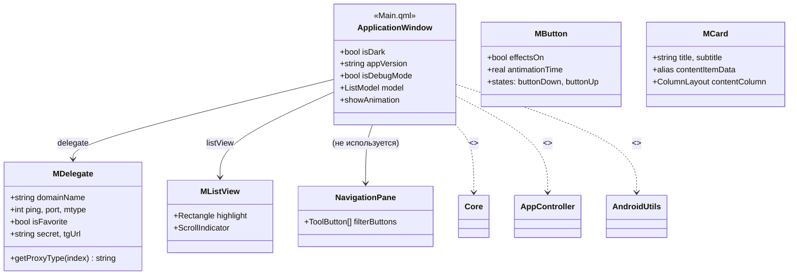
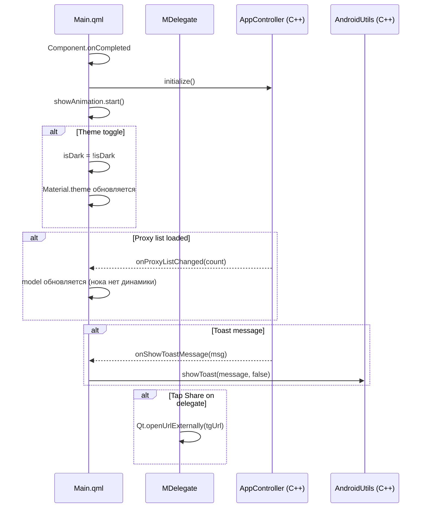

# Архитектура и взаимодействие: QML Frontend

## 1. Зона ответственности

QML-слой отвечает за отрисовку UI, обработку касаний и визуализацию данных от C++ бэкенда. Состоит из главного окна (`Main.qml`), кастомных компонентов (`MButton`, `MCard`, `MDelegate`, `MListView`, `NavigationPane`) и двух неиспользуемых компонентов из `plugins/ui/`.

Все C++ синглтоны импортируются и доступны глобально. Связь с C++ — через `Connections { target: AppController }` и прямые вызовы `AppController.initialize()`, `AndroidUtils.showToast()`.

## 2. Структура классов и QML-типов



## 3. Сценарий взаимодействия (Рантайм)



## 4. Аудит кода (Ошибки, DRY, Нарушения)

---

### [Критичность] КРИТИЧЕСКАЯ: Несуществующие идентификаторы в MListView

- **Локация:** `app/qml/MListView.qml:8-12`
- **Суть ошибки:** Используются идентификаторы `darkMode`, `solarizedBase03`, `solarizedBase0`, `solarizedBase2`, `solarizedBase02`, которые не определены ни в самом компоненте, ни в импортированных модулях. QML-движок выдаст runtime-ошибки привязки, и компонент не сможет отрисоваться корректно.
- **Исправление:** Определить свойства в `MListView` или удалить ссылки:

```qml
property bool darkMode: false
readonly property color solarizedBase03: "#002b36"
readonly property color solarizedBase0: "#839496"
// ... etc
```

---

### [Критичность] ВЫСОКАЯ: Dead code — MainTest.qml никогда не загружается

- **Локация:** `app/main.cpp:125-129`
- **Суть ошибки:** Условие `#ifdef QT_DEBUG1` — опечатка. Макрос `QT_DEBUG1` никогда не определён, поэтому `MainTest.qml` никогда не загружается, даже в Debug-сборке. Должно быть `QT_DEBUG`.
- **Исправление:** Заменить `QT_DEBUG1` на `QT_DEBUG`.

---

### [Критичность] ВЫСОКАЯ: Дублирование кода между Main.qml и MainTest.qml

- **Локация:** `app/qml/Main.qml` и `app/qml/MainTest.qml`
- **Суть ошибки:** Около 50 строк дублируются (свойства `screenWidth`, `screenHeight`, `isMobile`, `baseSpacing`, `padding`, `m_radius`, Solarized цвета и т.д.). Нарушение DRY. Изменение темы/стиля требует правки двух файлов.
- **Исправление:** Вынести общие свойства и стили в отдельный QML-файл (например, `AppTheme.qml`) и переиспользовать через `include` или property-alias.

---

### [Критичность] ВЫСОКАЯ: Несуществующее свойство isDebugModeOFF

- **Локация:**
  - `plugins/ui/MemoCard.qml:28`
  - `plugins/ui/SimpleFlip.qml:27`
- **Суть ошибки:** Обращение к `appWnd.isDebugModeOFF`. Такого свойства нет (есть `isDebugMode`). В runtime — undefined, блок `if` никогда не выполняется.
- **Исправление:** Заменить на `appWnd.isDebugMode` или удалить блок.

---

### [Критичность] ВЫСОКАЯ: NavigationPane — все onClicked логируют "Россия"

- **Локация:** `app/qml/NavigationPane.qml:104-105, 125`
- **Суть ошибки:** Кнопки "Все" и "Настройки" в обработчике `onClicked` пишут `"Фильтр: Россия"` — copy-paste ошибка.
- **Исправление:** Заменить строки логов на корректные:

```qml
// кнопка Все: console.log("Фильтр: Все")
// кнопка Настройки: console.log("Настройки")
```

---

### [Критичность] СРЕДНЯЯ: Нет адаптивности под экраны — hardcoded 360×720

- **Локация:** `app/qml/Main.qml:90-91`
- **Суть ошибки:** Размер окна жёстко зафиксирован 360×720. На современных Android-устройствах с соотношением сторон 19.5:9, 20:9 и т.д. либо появятся чёрные полосы, либо содержимое будет обрезано (зависит от `flags`). При этом `visibility: Window.FullScreen` для mobile — окно растягивается, но контент ориентируется на эти 360×720.
- **Исправление:** Использовать `Screen.width`/`Screen.height` для динамического размера, либо применить Fluid Layout с пропорциональными привязками.

---

### [Критичность] СРЕДНЯЯ: MDelegate.tgUrl — binding пересоздаётся на каждое изменение свойств

- **Локация:** `app/qml/MDelegate.qml:21`
- **Суть ошибки:** `property string tgUrl: "tg://proxy?server="+domainName+"&port="+port+"&secret="+secret` — это QML-биндинг, пересчитывающий URL при изменении любого из четырёх свойств. Для статических данных не критично, но при подгрузке из C++ модели будет пересоздаваться многократно.
- **Исправление:** Использовать Qt 6.4+ inline binding или функцию-геттер, если URL нужен только по запросу.

---

### [Критичность] СРЕДНЯЯ: MDelegate.getProxyType — дублирование qsTr

- **Локация:** `app/qml/MDelegate.qml:163-168`
- **Суть ошибки:** Строки локализации `"Socks5"`, `"Padding"`, `"FakeTls"`, `"Unknow"` (опечатка: `Unknow` → `Unknown`) определены прямо в функции. Не вынесены в отдельные константы/свойства.
- **Исправление:** Вынести в свойства компонента, исправить опечатку.

---

### [Критичность] НИЗКАЯ: Неиспользуемые QML-компоненты

- **Локация:** `plugins/ui/` — `MemoCard.qml`, `SimpleFlip.qml`
- **Суть ошибки:** Модуль `ui` закомментирован в `plugins/CMakeLists.txt`, компоненты нигде не используются. При этом в `SimpleFlip.qml` рекурсивная загрузка через `Loader { source: (root.useShader ? "ShaderFlip.qml" : "SimpleFlip.qml") }` — при `useShader=false` грузит саму себя, что потенциально ведёт к бесконечной рекурсии.
- **Исправление:** Либо удалить, либо раскомментировать и доработать. Убрать самозагрузку из Loader.

---

### [Критичность] НИЗКАЯ: Game-ориентированные тесты из другого проекта

- **Локация:** `tests/auto/tst_boardgenerator/`, `tests/auto/tst_imagedatamanager/`
- **Суть ошибки:** Тесты ссылаются на классы `BoardGenerator` и `ImageDataManager`, которых нет в этом проекте. Очевидно, скопированы из проекта `MemoPvP`. Подключение тестов закомментировано, но файлы остались.
- **Исправление:** Удалить файлы или заменить на актуальные тесты для MTProxyInspector.
